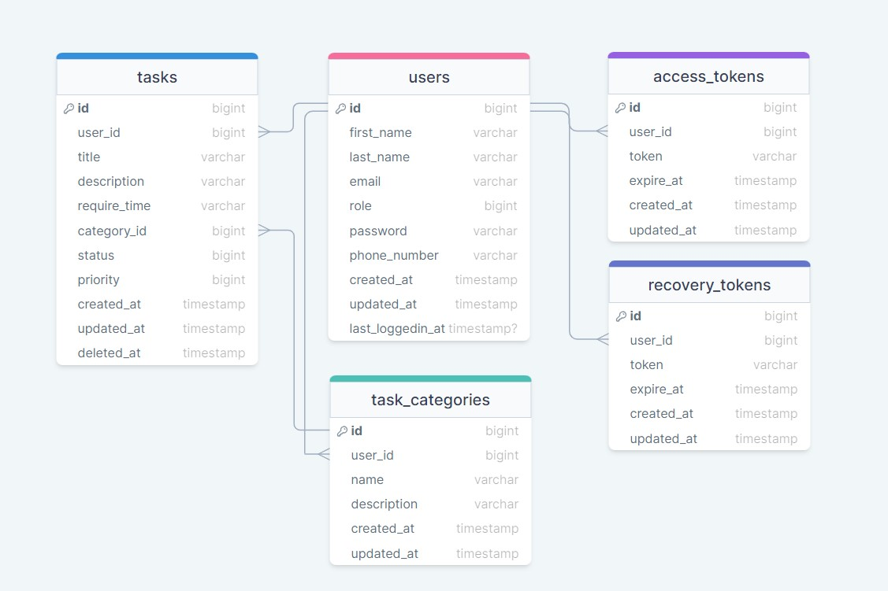

# Task Manager App

Welcome to the Task Manager App! This application helps you manage your tasks efficiently.

## Features

-   **Task Management:** Organize your tasks with ease.
-   **User Authentication:** Securely log in to your account.
-   **Task Status:** Mark tasks as completed, pending, or in-progress.
-   **Priority Levels:** Assign priority levels to tasks.
-   **Due Dates:** Set due dates for tasks to stay on track.
-   **User-Friendly Interface:** Intuitive design for a seamless user experience.

## Getting Started

### Prerequisites

-   PHP (version 8.x)
-   Laravel (version 8.x recommended)
-   Composer

### Installation

1. Clone the repository:

    ```bash
    https://github.com/Hsnmsri/taskmanager_backend.git
    ```

2. Install dependecies
    ```bash
    composer install
    ```
3. Create .env file
    ```bash
    cp .env.example .env
    ```
4. Create Mysql Database
5. Set Database connection data on .env file
6. Run Migration
    ```bash
    php artisan migrate
    ```
7. Run Application
    ```bash
    php artisan serve
    ```

# Project Details

The Task Manager is a Laravel-based application designed to help users manage their tasks efficiently. It includes various features such as task creation, categorization, and user settings.

## Database Diagram



## Models

### 1. AccessToken

The `AccessToken` model represents the access tokens used for authentication and authorization in the application.

### 2. RecoveryToken

The `RecoveryToken` model is responsible for handling recovery tokens used in password recovery processes.

### 3. Task

The `Task` model represents individual tasks within the system. It includes attributes such as title, description, status, due date, etc.

### 4. TaskCategories

The `TaskCategories` model defines the categories to which tasks can be assigned. It helps in organizing and categorizing tasks.

### 5. User

The `User` model represents the application's users. It includes details such as username, email, password, etc.

## Controllers

### 1. TaskController

The `TaskController` is responsible for managing tasks. It handles tasks CRUD operations, task categorization, and other related functionalities.

### 2. UserController

The `UserController` manages user-related settings and access tokens. It includes functionalities such as updating user information, managing tokens, etc.

## Middleware

### UserAuth Middleware

The `UserAuth` middleware is used to check the validity of the user's access token in incoming requests. It ensures that only authenticated and authorized users can access protected routes.

## Project Structure

```plaintext
project-root/
│
├── app/
│   ├── Http/
│   │   ├── Controllers/
│   │   │   ├── TaskController.php
│   │   │   └── UserController.php
│   │   ├── Middleware/
│   │   │   └── UserAuth.php
│   │   └── ...
│   ├── Models/
│   │   ├── AccessToken.php
│   │   ├── RecoveryToken.php
│   │   ├── Task.php
│   │   ├── TaskCategories.php
│   │   └── User.php
│   └── ...
├── database/
│   ├── migrations/
│   └── ...
├── routes/
│   ├── web.php
│   └── ...
└── ...
```
## Postman Collection

Download the Postman collection to explore and test the API:

[Download Postman Collection](documents/Task%20Manager.postman_collection.json)
